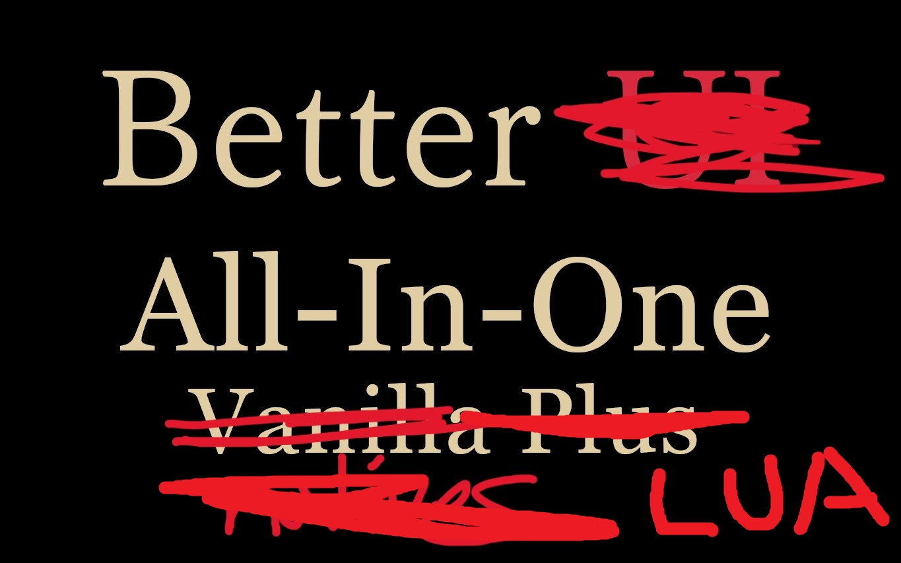

# DD2 LUA Mod Fixes
A collection of Dragon's Dogma 2 REFramework LUA mods that I fixed. Use at your own risk.

## Fixed Mods 

### [Shut Up Pawns](https://www.nexusmods.com/dragonsdogma2/mods/248)
- Fixed errors involving  PopStyleColor() and TreePop()
- Fixed possible `nil` access values when it tries to obtain `app_MessageManager`
- It will now try to reobtain the `app_MessageManager` if it is never loaded

### [Hide Helmets Out of Combat](https://www.nexusmods.com/dragonsdogma2/mods/961)
- Now checks if we are in combat every 15 frames instead of every frame, reducing performance impact.
- Fixed equipment errors and updated to latest REFramework method calls

### [Mark Important NPCs](https://www.nexusmods.com/dragonsdogma2/mods/433)
- Fixed ImgGUI call errors
- Added new option to show an exclaimation (!) to mark important NPCs
- Added new config variables to customize its color and size
- Added new config variable to set how often the mod searches for important NPCs to reduce performance impact

### [Carry It For Me](https://www.nexusmods.com/dragonsdogma2/mods/284)
- Fixed GetItem calls to use the updated signatures
- GetItemOption.EventType is now being used instead
- Fixed a bug pertaining to event items never being filtered correctly
- Fixed equipment not being passed to pawns

## Working but Optimized Mods
These are mods that are working but have issues that irked me to hell.

### [Better Better Item Desccription](https://www.nexusmods.com/dragonsdogma2/mods/338)
Technically this mod works as is, but I was getting sick and tired of this shit spamming my logs and how it'd just break when debugging other things.

- Now initializes correctly and not only when a player loads a save game
- Logging is back to just being info logs instead of error logs (_NickCore for some reason defaults to error type logs)
- Fixed naming/cache name misspelling

### [Clock](https://www.nexusmods.com/dragonsdogma2/mods/150)
This mod is technically working but by the brine does it eat up resources at high FPS. It accounts for 10% of the game's tick cycle alone! Now its more like 1%.

- Optimized the heck out of it.
- Got rid of seconds. It was never needed.
- We peg TimeManager every 0.5 second (4x per in-game minute) instead of every frame
- The display string is now cached. We only update once every in-game minute (2 seconds real world)
- Any changes to settings updates the cache immediately.
- Changing font size no longer requires a restart
- Added ability to disable the clock during cutscenes (tho what the game counts as cutscenes is spotty)
  - This check is done every 0.5 sec as it is costly otherwise
